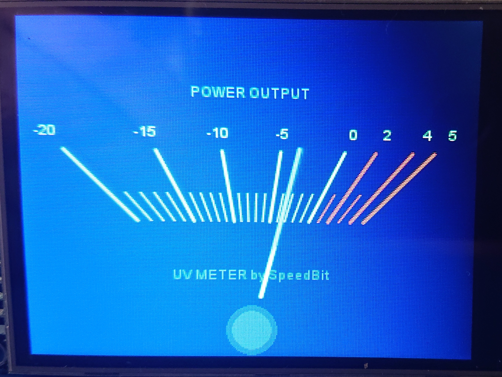
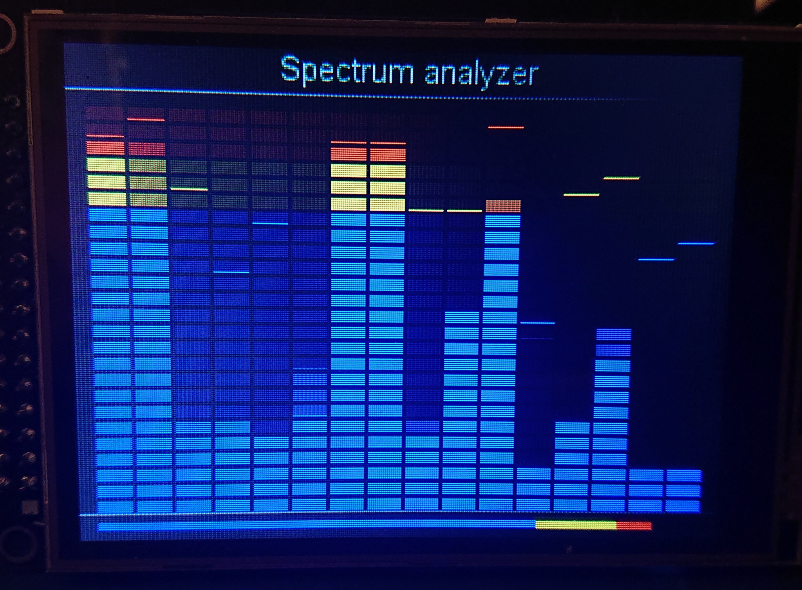
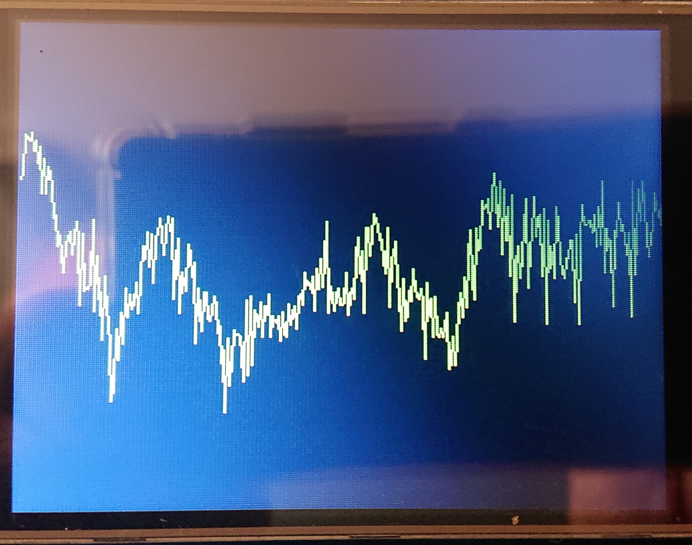
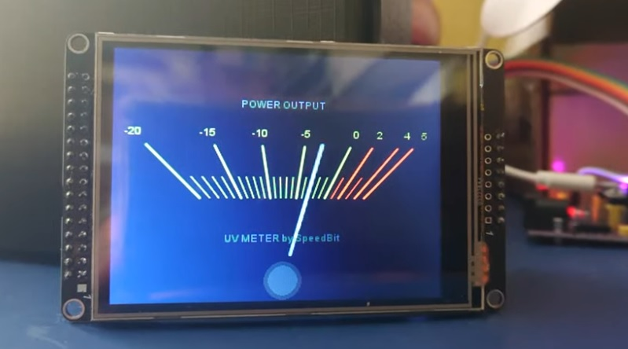

# 🎛️ ESP32 VU Meter — analog, spectrum and waveform audio meters for ESP32

**Three classic audio meters in one firmware project — an analog needle straight out of an 80s hi-fi amplifier, a multi-band spectrum analyzer, and an oscilloscope-style waveform display — all running on a single ESP32 and an ILI9341 display, at a smooth 30+ FPS thanks to hardware ADC continuous mode and on-the-fly FFT.**

If you miss the analog VU needles from old tape decks and amplifiers, you're building your own amp, a DIY headphone enclosure, or you simply want your audio project to *look* as good as it sounds — this project is for you. All the rendering logic, signal smoothing and FFT processing is ready to go — you just tune the look and feed it an audio signal.

<p align="center">
  
  
  
</p>
<br>

<p align="center">
  <a href="https://www.youtube.com/watch?v=YTGsCEk3dHk">
    
  </a>
  <br>
  <small><i>Ctrl + Click (or Cmd + Click) the image to watch the video in a new tab</i></small>  
</p>

---

## ✨ What's inside

| Component | What it does | Vibe |
|---|---|---|
| **AnalogVUMeter** | Analog needle on an angled scale, in the style of classic VU meters (e.g. Technics SE-A) | Nostalgic, "vintage hi-fi" |
| **SpectrumVUMeter** | 16-band spectrum analyzer with "brick" segments, peak-hold and a linear VU bar | Club / studio |
| **WaveVUMeter** | Real-time audio waveform (oscilloscope-style) | Technical / raw |

All three meters:
- read audio directly from the ESP32 ADC in **continuous DMA mode** (without blocking the main loop),
- (Analog and Spectrum) run an **FFT** on the audio samples using the `arduinoFFT` library,
- draw to the display via `TFT_eSPI`, only redrawing changed screen regions (not the whole framebuffer) — so they stay smooth even on hardware without PSRAM,
- expose a rich set of public fields you can tweak *before* calling `begin()`, so you can match the look to your own enclosure and style.

---

## 🧰 Hardware

- An **ESP32** board (any board from the `esp32dev` family)
- An **ILI9341** display (320×240, SPI)
- An audio signal fed into the ADC input — by default **ADC1, channel 0**, i.e. pin **GPIO36 (VP)**. Make sure to condition the signal to the 0–3.3 V range (coupling capacitor + bias to roughly 1.65 V, so you don't overload the input — see `adc_multiplier`/`adc_divider` below).

### Default display pinout (from `platformio.ini`)

| Signal | ESP32 pin |
|---|---|
| MISO | 19 |
| MOSI | 23 |
| SCLK | 18 |
| CS | 5 |
| DC | 2 |
| RST | 4 |
| TOUCH_CS | 14 |

Driver: `ILI9341_DRIVER`, SPI @ 40 MHz. Everything is set via `build_flags` in `platformio.ini` — no need to manually edit the TFT_eSPI `User_Setup.h`.

---

## 🚀 Building and running (Visual Studio Code + PlatformIO)

1. **Install Visual Studio Code**, then add the **PlatformIO IDE** extension (Extensions → search "PlatformIO IDE" → Install). PlatformIO will automatically pull the correct ESP32 toolchain the first time you open the project.
2. **Clone the repository**:
   ```bash
   git clone https://github.com/SK-SpeedBit/ESP32_VU_Meter.git
   ```
3. **Open the project folder in VS Code** via `File → Open Folder…` (the folder must contain `platformio.ini` at its root).
4. Wait for PlatformIO to fetch the dependencies declared in `platformio.ini`:
   - `bodmer/TFT_eSPI` (display driver)
   - `kosme/arduinoFFT` (FFT)
5. Connect the ESP32 over USB and select it as the target environment (`env:esp32dev` in the PlatformIO status bar).
6. **Build & Upload** — using the icons in the PlatformIO status bar (right-arrow = upload), or from the command palette: `PlatformIO: Upload`.
7. Open the **Serial Monitor** (115200 baud) — `platformio.ini` defines the `ENABLE_DEBUG=1` flag, so the firmware logs diagnostic info (e.g. RAM usage) via `DEBUG_PRINT/DEBUG_PRINTLN/DEBUG_PRINTF` from `include/config.h`.

### What the `src/main.cpp` example does

The default `main.cpp` is a ready-made demo of all three meters running on a single device:

- The program initializes `AnalogVUMeter`, `SpectrumVUMeter` and `WaveVUMeter` in turn, on a shared `TFT_eSPI` object.
- In the main loop, **every 15 seconds** (`SWITCH_TIME`) it switches the active meter type in order: **Analog → Spectrum → Wave → Analog...**
- For `WaveVUMeter`, it additionally changes the waveform color **every 3 seconds**, cycling through the `colorTable[]` array (green, blue, red, purple, yellow, pink) — the simplest example of changing a parameter "live", while the firmware is running.
- Each meter has its background saved (`saveBackground()`), so switching between them is fast and doesn't require redrawing static elements (labels, scale, frames) from scratch.

This is the best starting point to see all three styles in action before you start tuning parameters for your own project.

---

## ⚙️ Component parameters

All parameters are public fields on the classes — set them directly on the object **before calling `begin()`**, e.g.:

```cpp
AnalogVUMeter avu;
avu.scale_ValMin = -30;
avu.scale_ValMax = 5;
avu.needle_Color = TFT_RED;
avu.begin(tft);
```

### 🎚️ AnalogVUMeter — analog needle

**Background & dithering**
| Field | Default | Description |
|---|---|---|
| `backgroundColor` | `TFT_BLUE` | Background color / base color of the background image |
| `foregroundColor` | `TFT_BLACK` | Color of the dithering dots |
| `backgroundDither` | `4` | Dither grain size |

**Scale**
| Field | Default | Description |
|---|---|---|
| `scale_Color` | `0x9ca6` | Scale color |
| `scale_ColorHLevel` | `TFT_RED` | Scale color above zero (overload zone) |
| `scale_TextColor` / `scale_TextBkgColor` | `0x9ca6` / transparent | Label text color and its background |
| `scale_BaseLineColor` | `TFT_YELLOW` | Baseline color |
| `scale_PosAxisX`, `scale_PosAxisY` | `160`, `550` | X/Y axis position used to draw the scale profile |
| `needle_PosAxisY` | `220` | Y-axis position for needle rotation and scale angles |
| `scale_linear` | `true` | Flat scale (straight line) instead of an arc |
| `scale_linearTicks` | `true` | Flat tick labels (along the lines) |
| `scale_HighLevelZone` | `true` | The scale has a dedicated overload zone |
| `scale_DrawBaseLine` | `false` | Draw a baseline (straight line or arc) |
| `scale_hLevel` | `410` | Base arc radius of the scale |
| `scale_BaseArcWidth` | `4` | Scale line thickness |
| `scale_MarginPx` | `10` | Margin in pixels from the screen edge |
| `scale_MinorWidth` / `scale_MajorWidth` | `1.0` / `2.0` | Minor / major tick line width |
| `scale_MinorLen` / `scale_MajorLen` | `20.0` / `50.0` | Minor / major tick length |
| `scale_MajorCnt` / `scale_MinorCnt` | `10` / `5` | Number of major / minor divisions |
| `scale_ValMin` / `scale_ValMax` | `-20` / `5` | Value at the leftmost / rightmost edge |
| `scale_MajorStep` / `scale_MinorStep` | `5` / `1` | Step between major labels / minor ticks |
| `scale_LineExtensionPx` | `20` | Extension of the line beyond the outermost ticks |
| `scale_ArcExtensionDeg` | `3` | Baseline extension for arc scales (in degrees) |

**Needle**
| Field | Default | Description |
|---|---|---|
| `needle_Color` | `0x8c51` | Needle color |
| `needle_Width` | `3.0` | Needle thickness |
| `needle_Smooth` | `0.5` | Movement smoothing (1 = fast, 0.25 = smooth) |
| `needle_AboveScale` | `52.0` | How far the needle tip extends above the scale |
| `needleRotateCircle` | `true` | Draw a circle imitating the rotation mechanism |
| `hideNeedleBelowY` | `195` | Lower boundary of the "housing" that hides the needle |
| `needle_VarLength` | `true` | Variable-length needle |

**Configuration methods (call before `begin()`):** `setVUTextFont(size)`, `setVUScaleFont(size)` (font sizes: 8–16), `setRange(minValue, maxValue)`.

> Internally the engine works on 16 FFT bands from a 512-sample buffer (~10 ms per cycle) — the `bandCutoffTable`, `bandLabels` and `bandGainTable` tables are private, but the source code includes a commented-out alternative for 1024 samples (higher resolution, ~20 ms per cycle), in case you need more precision at the cost of refresh time.

---

### 📊 SpectrumVUMeter — spectrum analyzer

**Margins & grid**
| Field | Default | Description |
|---|---|---|
| `margin_left` / `margin_right` | `2` / `2` | Left/right screen margins |
| `margin_top` | `20` | Top margin — when a title is present, set ≥ (2 + font size + 2) |
| `margin_bottom` | `14` | Bottom margin — set 35 when `drawDescriptions` is on, or above `lineVUWidth` (ideally 2×) when `showLineVUMeter` is on |
| `gap_X` / `gap_Y` | `2` / `2` | Horizontal/vertical spacing between "brick" segments |
| `segments_per_band` | `25` | Number of bricks in a band column |
| `threshold_red` / `threshold_yellow` | `22` / `19` | Level from which bricks turn red / yellow |

**Colors**
| Field | Default | Description |
|---|---|---|
| `text_color` | `TFT_DARKGREY` | Text color |
| `background_color` | `0x0000` | Background color |
| `frame_color` | `0x18C3` | Frame color |
| `base_color_normal` | `TFT_BLUE` | Brick color in the normal range |
| `base_color_warningZone` | `TFT_ORANGE` | Brick color in the warning zone |
| `base_color_highZone` | `TFT_RED` | Brick color in the overload zone |

**Drawing behavior / options**
| Field | Default | Description |
|---|---|---|
| `drawtileFrame` | `false` | Draw a frame around each brick (LED-like look) |
| `drawDescriptions` | `false` | Draw band labels (remember to adjust `margin_bottom`) |
| `descriptionsAsFreq` | `false` | Labels shown as the band's center frequency |
| `autoSizeWidth` | `true` | Automatically fit the width to the screen |
| `autoCenterWidth` | `true` | Automatically center on screen |
| `showWarningZoneTiles` / `showHighZoneTiles` | `true` / `true` | Show bricks in the warning / overload zone |
| `showPeaks` | `true` | Show peak-hold indicators |
| `peaksHeight` | `1` | Peak segment height (0 = auto) |
| `peaksHoldTime` / `peaksFallTime` | `300` / `250` ms | Peak hold / fall time |

**Linear VU bar** (an extra indicator drawn below/above the spectrum)
| Field | Default | Description |
|---|---|---|
| `showLineVUMeter` | `true` | Show the linear VU bar |
| `lineVUMeterAsBricks` | `false` | Draw the bar as bricks instead of a continuous line |
| `lineVUWidth` | `4` | Bar height |
| `lineVU_segments` | `22` | Number of segments (brick mode) |
| `lineVU_threshold_red` / `lineVU_threshold_yellow` | `19` / `16` | Color thresholds (brick mode) |
| `lineVUColor` / `lineVUColorWarningZone` / `lineVUColorHighZone` | `TFT_BLUE` / `TFT_YELLOW` / `TFT_RED` | Colors for normal / warning / overload zones |
| `lineVULeftMargin` / `lineVURightMargin` | = `margin_left` / `margin_right` | Bar margins |
| `lineVUWidthAsSpectrum` | `true` | Match the bar width to the spectrum margins |

**Configuration methods:** `setVUTextFont(size)` (8–16), `drawTopMarginText(text, size, color)` — an empty string clears the top margin, otherwise it prints centered text with the given font and color (reserve at least 20 px of height).

---

### 🌊 WaveVUMeter — waveform (oscilloscope)

| Field | Default | Description |
|---|---|---|
| `backgroundColor` | `TFT_BLACK` | Background color |
| `foregroundColor` | `TFT_GREEN` | Waveform line color |
| `drawZeroLine` | `false` | Draw a zero-level reference line |
| `drawPixelinsteadLine` | `false` | Draw individual pixels instead of a continuous line |
| `adc_multiplier` | `1.45` | Amplitude multiplier (to fill the whole screen) |
| `adc_divider` | `3300` | ADC data divider — full scale is 0–3.3 V, so the zero line sits at 1.65 V. **Watch out for ADC input overload!** |
| `levelZeroCorrection` | `18` | On-screen zero-level correction (px) |

This is by far the simplest of the three meters to configure — a great starting point if you're just getting familiar with the library, before moving on to the more elaborate `SpectrumVUMeter` or `AnalogVUMeter`.

---

## 🏗️ Project structure

```
ESP32_VU_Meter/
├── include/
│   └── config.h              # DEBUG_PRINT/PRINTLN/PRINTF macros (enabled via the ENABLE_DEBUG flag)
├── lib/
│   ├── AnalogVUMeter/        # analog VU needle
│   ├── SpectrumVUMeter/      # spectrum analyzer
│   ├── WaveVUMeter/          # waveform display
│   ├── Global_VUMeter/       # shared global variables (tft, adc_handle, adc_owner)
│   └── fonts/                # Final_Frontier font set in sizes 8-16
├── src/
│   └── main.cpp              # demo example (cycling through the three meters)
├── images/                   # screenshots used in this README
└── platformio.ini            # PlatformIO configuration / pinout / dependencies
```

The shared `Global_VUMeter` mechanism (`extern TFT_eSPI tft`, `extern adc_continuous_handle_t adc_handle`, `extern uint16_t adc_owner`) lets the three meters safely share a single ADC handle and a single display object — so you can switch between them at any time without reconfiguring the hardware from scratch, exactly as `main.cpp` does.

---

## 📄 License

This project is licensed under the **MIT License** — see [`LICENSE`](LICENSE) for details. In short: free to use, modify and redistribute, even commercially, as long as the original copyright notice is kept.


---

<p align="center"><i>README put together with the help of Claude 🤖 — because a good project deserves a good write-up ;-)</i></p>
